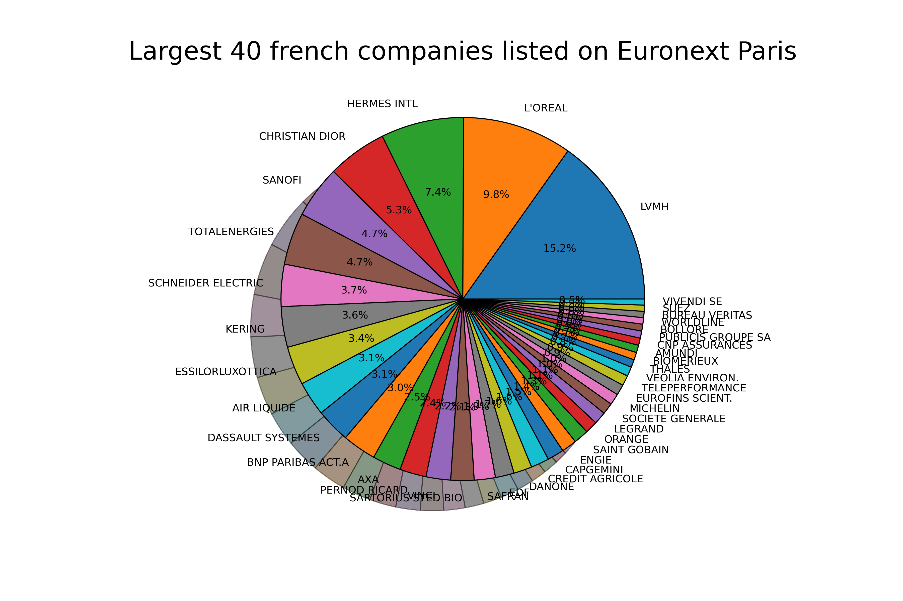
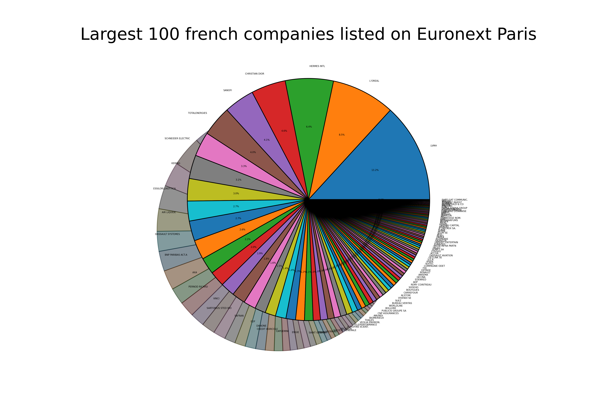
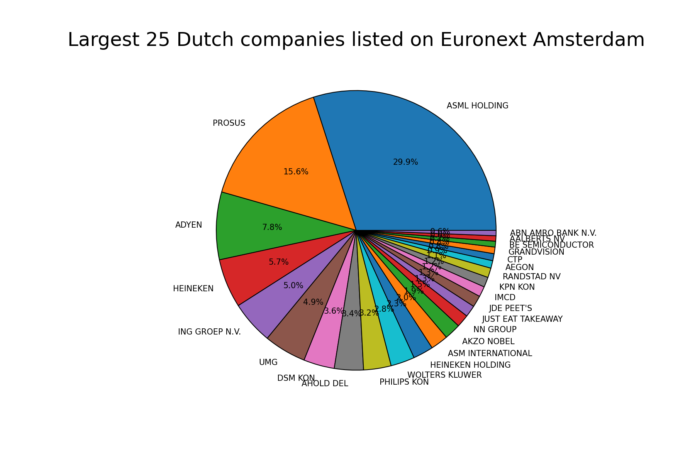
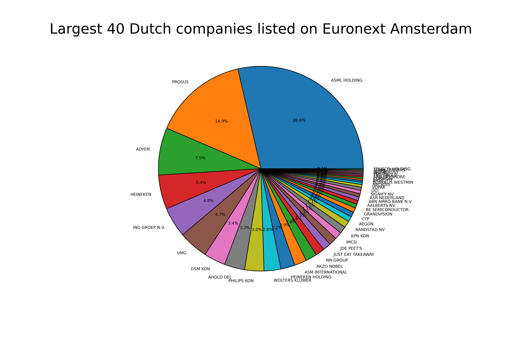

# Euronext-Market-Cap
### Simple data visualisation of largest French listed companies on Euronext Paris by Market Cap

In this project, we use Python-based tools (Re, Pandas, BeautifulSoup) to display the largest market capitalizations on Euronext market.

(Screening performed on November 26, 2021)

## Protocol
First we import data from Euronext website and then parse with __*pandas*__ library.
```
df= pd.read_excel("dataParis.xlsx")
df.drop([0,1,2], inplace=True)
df.reset_index(drop=True, inplace=True)
```

#### Then we iterate threw each row and use Euronext API to get Market Capitalization with __*BeautifulSoup*__.
Necessary import :
```
import pandas as pd
pd.options.display.max_rows = 50
import requests
from bs4 import BeautifulSoup
import re
import matplotlib.pyplot as plt
```

Firstly, we create a function which use Euronext API to get Market Cap of each company by ISIN
```
def getMarketCap(ISIN):
    url = f"https://live.euronext.com/fr/intraday_chart/getDetailedQuoteAjax/{ISIN}-XPAR/full"
    response = requests.get(url)
    if(response.ok):
        soup = BeautifulSoup(response.text)
        try:
            capitalization = soup.find("tbody").findAll('tr')[11].find(class_="font-weight-medium").text
            return capitalization
        except IndexError:
            return 0
```

Then we convert from String to float the result of the previous function
```
def convertToInt(ISIN):
    if(type(ISIN)==str):
        if("Md" in ISIN):
            return (float(ISIN.replace("Md","").replace(",",".")))
        if("Md" in ISIN):
            return 0
```

Data visualization code
```
def pieByPercent(i,size=150):
    plt.rcParams['figure.dpi'] = size
    plt.rcParams['savefig.dpi'] = size
    name = df['Name'].to_list()
    marketCap = df['MarketCap'].to_list()
    plt.pie(marketCap[0:i], labels =name[0:i], wedgeprops={'edgecolor':'black', 'linewidth': 0.5}, shadow=True, autopct='%1.1f%%', textprops={'fontsize': 1500/size})
    plt.title(f"Largest {i} french companies listed on Euronext Paris")
    plt.savefig(f"piechart{i}")

```

This process is performed only on stocks valued at more than 1 billion euros (using __*re*__)







